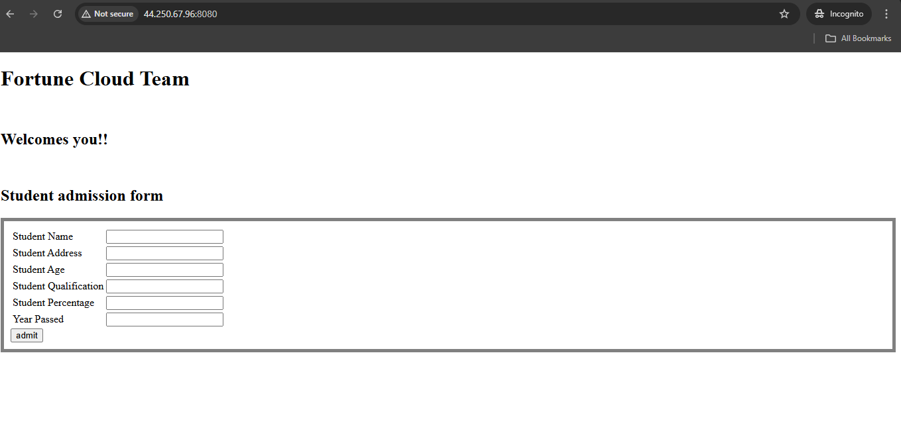

# Deploying Java Application by using Maven and CICD Pipeline


This project is a Java-based application designed to showcase a complete and professional build and deployment workflow using Maven and CI/CD pipelines. It simulates the real-world software delivery lifecycle, focusing on automation, reliability, and scalability critical aspects of modern DevOps practices.

In today’s fast-paced software development environment, ensuring rapid delivery without compromising quality is essential. Manual builds, testing, and deployments are not only time-consuming but also prone to human errors. This project eliminates those inefficiencies by incorporating a fully automated continuous integration and continuous deployment (CI/CD) pipeline into a Java application, helping developers deliver code faster, safer, and more efficiently.

## What is Maven ?


Maven is a build automation tool developed using the Java programming language. It is primarily used for Java-based projects to manage the build process, including source code compilation, testing, packaging, and more. Maven utilizes the Project Object Model (POM), where the pom.xml file describes the project’s configuration and dependency management.


## Why Use Maven?

- Automatically downloads and manages all required libraries (JARs) using a single pom.xml file.


- Compiles code, runs tests, and packages the application into .jar or .war files with simple commands.

- Follows a consistent folder layout, making projects easier to understand and maintain across teams.

- Easily integrates with tools like Jenkins for automated build, test, and deployment pipelines.


## Project Objectives

The core objectives of this project are:

- This project automates the entire lifecycle of a Java application — from code checkout, building, and testing, to packaging and deploying the application to a remote ubuntu server.

- The pipeline is defined in a single `Jenkinsfile` using **Declarative syntax**, making the CI/CD process easy to manage and version-controlled.

- Using **Maven** for dependency management and **Jenkins** for automation, the pipeline ensures fast, error-free, and consistent deployments whenever new code is pushed to the repository.


#### *NOTE : Before Starting the project refer this website*

1. https://maven.apache.org/guides/getting-started/maven-in-five-minutes.html


## Step → 1 : Sign in to Amazon Web Services Console

login to the Amazon Web Services Console using your credentials.


## Step →  2 : Create two EC2 Instance

In the AWS Management Console search bar, enter EC2, and click the EC2 result under Services:

Click on Instances → Create instance


## Step → 3 : Connecting to an Instance using SSH

```bash
ssh -i <private-key> ubuntu@<public-IP>
```


## Step → 4 Install Jenkins on Jenkins server

- Jenkins is built on Java so, to install Jenkins we first need to install Java on the ubuntu server.

- Run the below command on the jenkins

```bash
sudo apt update
sudo apt install openjdk-17-jdk -y
java --version
```

- Now, Run the below commands on the Jenkins for jenkins Installation

```bash
sudo wget -O /etc/apt/keyrings/jenkins-keyring.asc \
https://pkg.jenkins.io/debian-stable/jenkins.io-2023.key
echo "deb [signed-by=/etc/apt/keyrings/jenkins-keyring.asc]" \
https://pkg.jenkins.io/debian-stable binary/ | sudo tee \
/etc/apt/sources.list.d/jenkins.list > /dev/null
sudo apt-get update
sudo apt-get install jenkins
```

- Now, Start and Enable Jenkins

```bash
sudo systemctl start jenkins
sudo systemctl enable jenkins
```

## Step → 5 : Install Maven on Jenkins

```bash
sudo apt install maven
mvn --version
```


## Step → 6 : Clone Project on Jenkins

```bash
git clone <github-repo-url>
```


- Project Structure


## Step → 7 : Buid the Project using maven

- To build project using this command 

```bash
sudo mvn clean package
```


- It will Create a folder Named **Target**

- Then Enter this folder

```bash
cd target/
```


## Step → 8 : Insatll Java And Tomcat on Student-app


```bash
sudo apt update
sudo apt install openjdk-17-jdk
java --version
sudo apt insatll tomcat10
tomcat --version
```


## Step → 9 : Start the Tomcat Server

```bash
sudo systemctl start tomcat10
sudo systemctl enable tomcat10
sudo systemctl status tomcat10
```


## Step → 10 : Run the application using public IP


## Step → 11 : Copy the Private key from local machine to jenkins server

- Copy private key Using this command :

```bash
scp -i jenkins-key.pem jenkins-key.pem ubuntu@<public-IP>:/home/ubuntu/
```


## Step → 12 : Sign in Jenkins server and create new Credentials

1. Go to Manage Jenkins → Credentials

2. Add a new SSH Username with private key


3. Click → Global


4. Global Credentials → Add Credentials


5. Choose:

- Kind → SSH Username with private key

- ID → Student-app-id

- Username → ubuntu

- Private Key → Enter your private key directly or upload it

Click → Create


## Step → 13 : Create a new job

1. Click → New Item


2. Enter a job name → (e.g., student-app-job)

3. Select:

- Pipeline (recommended for full CI/CD)


1. Source Code Management

2. Choose Git

- Enter your GitHub repo URL (e.g., https://github.com/yourname/java-ci-app.git)


3. Select → Branch → Master

4. Script Path → Jenkinsfile (or specify a subfolder path)

5. Click on → Save


## Step → 14 : Build a Job

1. Click → Build Now

- Check Console Output to monitor logs


If tests pass and the package is successful, your deployment step should execute


## Step → 15 : Enter the public IP address in a web browser to view the deployed app.


*So, Application Was Successfully Deployed!!!*





## Summary :

This project shows how to automate the building, testing, and deployment of a Java application using Maven and Jenkins.We use a Jenkinsfile to define every step of the process from downloading the code, building it, running tests, creating a .jar file, and finally deploying it to a remote server.Using Maven helps manage all the project’s dependencies and tasks like compiling and packaging the code.
Using Jenkins makes sure the process happens automatically every time you push new code making it faster, more reliable, and reducing human errors.


